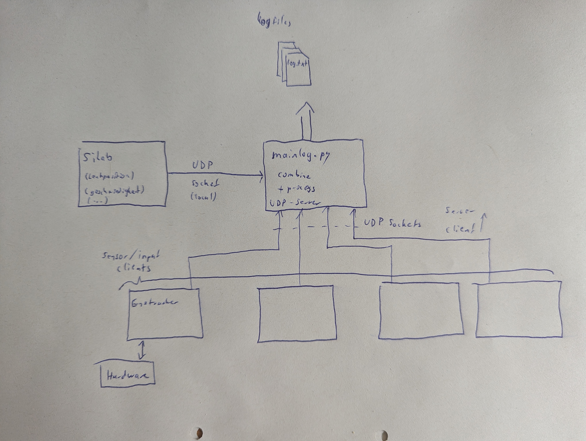

# Documentation about the logging system

## Why?

Because of the complicated logging system of SiLab we decided to go the other way around and export the loging data of SiLab and use an external python script instead.
With this system we archive an easier and more expandable method of logging.

## Concept

The **mainlog.py** builds the center of the logging system. It hosts a UDP server to witch SiLab and other clients *connect/report*.
Thus, a variety of different sensors/inputs can be logged to a central logfile.
The recording of the logfile will only take place, when SiLab reports data and will automatically be stored in logfiles. (After a defined timeout a new file will be generated)
The input/client programs have to process their own data (e.g. from an eyetracker module) and convert them to a string, which will be logged with a timestamp.

Synchronisation of the different inputs is not yet implemented, but may will be in the future.

